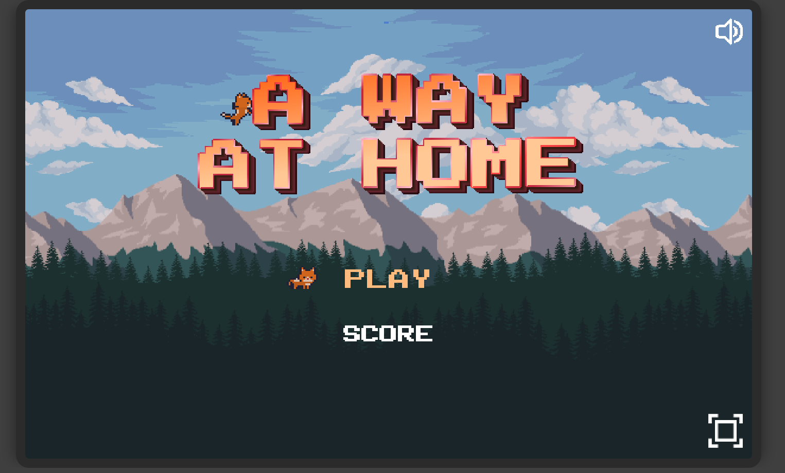

# Game "A way at home"

This is my own game, made as a final project in frontend courses. The main goal is to help the kitten get home by collecting treasures and defeating monsters.

## Table of contents

- [Overview](#overview)
  - [Information](#information)
  - [Screenshot](#screenshot)
  - [Links](#links)
- [My process](#my-process)
  - [Built with](#built-with)
  - [What I learned](#what-i-learned)

## Overview

### Information

<!-- Users should be able to:

- View the optimal layout for the app depending on their device's screen size
- See hover states for all interactive elements on the page
- Navigate between Home, Movies, TV Series, and Bookmarked Shows pages
- Add/Remove bookmarks from all movies and TV series
- Search for relevant shows on all pages
- **Bonus**: We provide authentication screen (sign-up/login) designs if you'd like to create an auth flow -->

### Screenshot

### Links

- [Live Site URL](https://way-at-home.netlify.app/)

## My process

### Built with

<!-- - Semantic HTML5 markup
- Flexbox
- CSS Grid
- Pug
- SCSS
- Native JavaScript
- Webpack
- Swiper JS - slider
- SweetAlert JS - for pop-ups
- Simple Notify JS - for notifications
- Firebase - for storing user data -->

### What I learned

<!-- Firebase, authentication, authorization, SPA, debounce function -->
